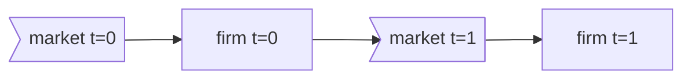
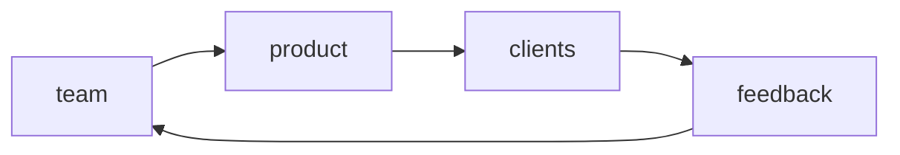
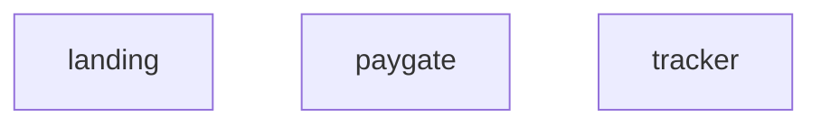

## Bayesian Project Management

In [#167001813](https://www.pivotaltracker.com/story/show/167001813), I would like to begin the work of formally starting the systems plan for my superforecast project. From here on out, I'm going to call this project "Bayesian Process Project Management" or "Bayesproc" for short.

## Business Systems Overview

### Goals

We want a system of diagrams that depicts:

- Models how the business will run
- How we will make modifications (e.g. filling in details, updates, etc.,) to the above model

### Desired Initial Phase

#### Philiosphical Level

At the philisophical level, the market (aka aggregate of firms) today affects the firm tomorrow cyclically.

#### Firm Overview

- The team develops the product
- The clients use our product
- The team receive feedback (aka payment, analytics, etc.,) from clients
- The "market" plugs in at:
  - "team" (aka hiring)
  - "clients" (customers, competition, etc.,)

#### Product Overview

Product development is a form of knowledge creation and, as per David Deutsch in Beginning of Infinity, the *only* possible method of knowledge creation is Darwin's method of random generation and then selection.

And, as this SD is the phase phase, a lot of initial product will be effectively "randomly generated" (via the hopefully slightly-better-than-random RNG machine that the amalgamation of my experiences in my brain)

TBD: breakdown the product lineup

#### Team Overview

TBD

#### Feedback Overview

TBD

#### Client Overview

TBD

## Additional Work

TBD

## Appendix

### Meta Analysis

Here, I document some thoughts and ideas regarding my own processes for drafting this planning document. Hopefully, I can one day analyze what I'm doing here and automate that to a machine.

#### Environment

- This document is drafted on Sunday July 7 in the afternoon
- I had just had some breakfast of vegetables and had just watched the first season of Netflix's Stranger Things with my wife
- I am writing this document in vs-code, standing at my makeshift standing desk around my kitchen at my Aliso Viejo apartment
- I am playing BGM from the [bloodborne ost](https://www.youtube.com/watch?v=tGeYmC9bK68&)
- I occasionally got distracted and started reading this Mozilla Firefox [pocket article](https://getpocket.com/explore/item/a-mountaineer-s-choice-to-never-have-kids?utm_source=pocket-newtab)

#### Processes and Thoughts

- How am I adding details to a rougher picture
- What am I doing when I think of a desired goal then try to write it down in this document?

## References

- Deutsch, David; Beginning of Infinity